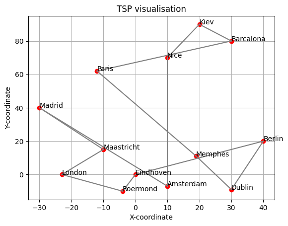
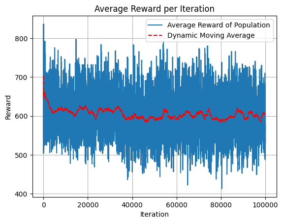
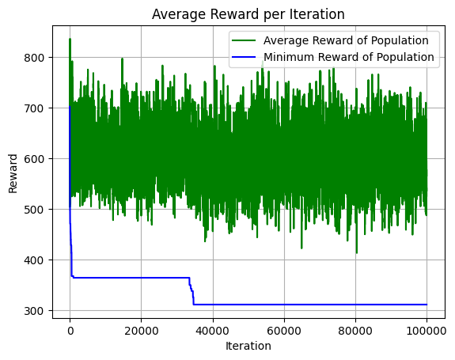

# Large Number of Itterations and Big population

## Simulation Parameters
Population = 500
Itteration = 100000
Number of cities = 13

\( \text{mutation} \coloneqq \text{random} \times mutation\ severtity \geq threshold, \ 0 \leq \text{random} \leq 1\) 

Mutation chance = 0.988 $\times$ random

## Runtime: 
Progress: 100%|██████████| 100000/100000 [28:53<00:00, 57.70it/s]

## Results:
Not converged, Weird solution 

