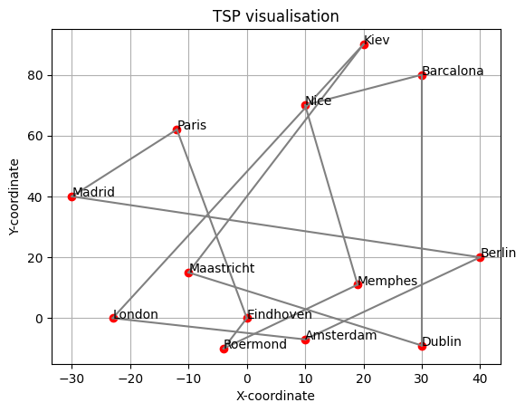
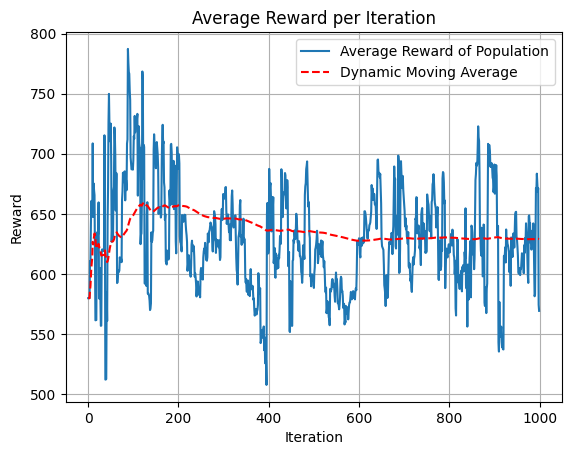
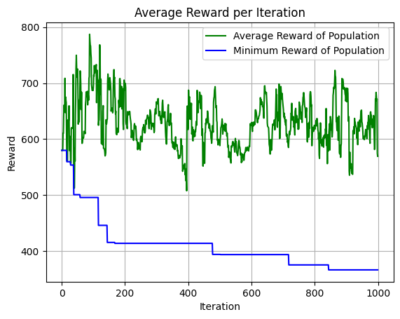

# Small Number of Itterations and Big population

## Simulation Parameters
Population = 500
Itteration = 1000
Number of cities = 13

\( \text{mutation} \coloneqq \text{random} \times mutation\ severtity \geq threshold, \ 0 \leq \text{random} \leq 1\) 

Mutation chance = 0.988 $\times$ random

## Runtime: 
Progress: 100%|██████████| 1000/1000 [00:15<00:00, 63.54it/s]

## Results:
Not Converged & Not optimal
Reward: 365.80510824885175 (this is the distance of the route)

