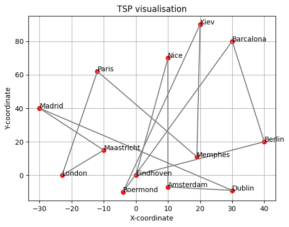
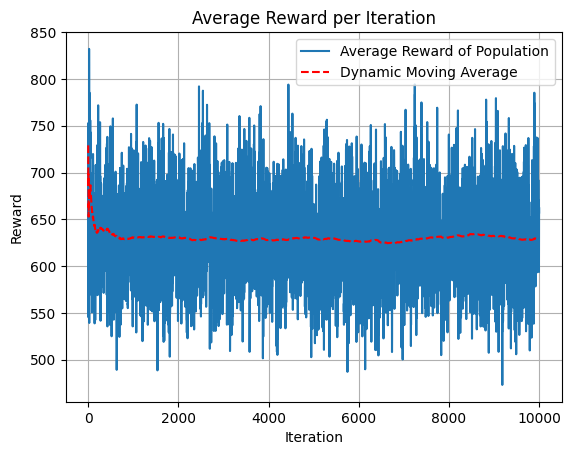
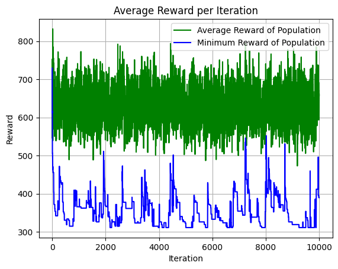

# See what happends when we dial up the mutation rate

## Simulation Parameters
Population = 50
Itteration = 10000
Number of cities = 13

\( \text{mutation} \coloneqq \text{random} \times mutation\ severtity \geq threshold, \ 0 \leq \text{random} \leq 1\) 

Mutation chance = 0.800 $\times$ random

## Runtime: 
Progress: 100%|██████████| 10000/10000 [00:09<00:00, 1051.36it/s]

## Results:
Result is unstable.
Reward: 389.7165724609135

