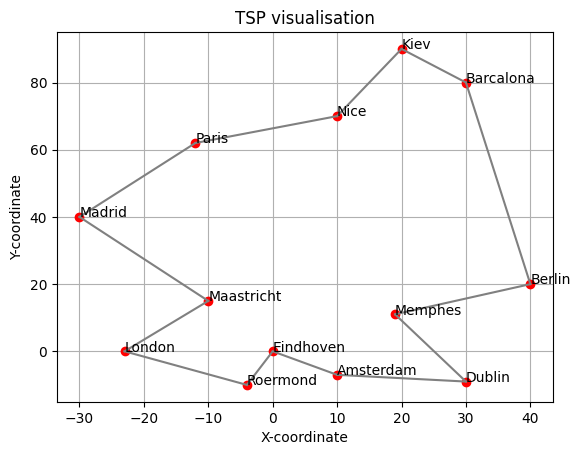
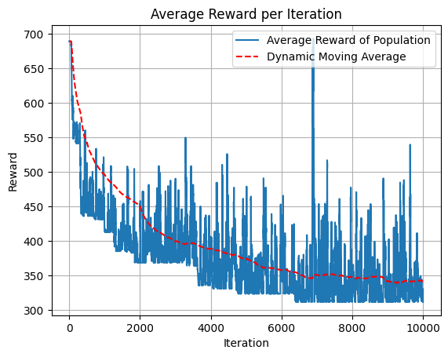
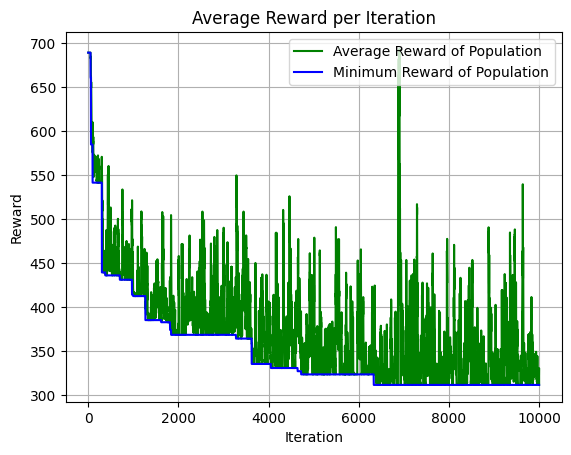

# Optimal Configuration

## Simulation Parameters
Population = 50
Itteration = 10000
Number of cities = 13

\( \text{mutation} \coloneqq \text{random} \times mutation\ severtity \geq threshold, \ 0 \leq \text{random} \leq 1\) 

Mutation chance = 0.988 $\times$ random

## Runtime: 
Progress: 100%|██████████| 10000/10000 [00:09<00:00, 1071.96it/s]

## Results:
Converged & optimal solution: 311.2505265231443 (this is the distance of the route)

